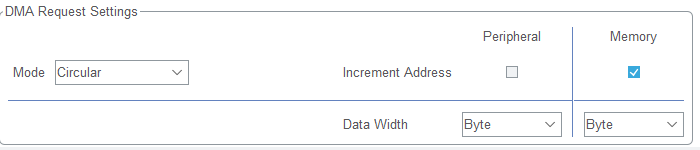

# UART

# STM32 UART HAL Driver

## Overview
This HAL driver to utilize the DMA on both the TX and RX of the port. The IOC will need to be configured to enable the DMA for both the TX and RX, see the IOC configuration
section for more information.

## IOC Configuration
First configure the uart parameters, use the picture below as a starting point and alter the configuration as needed for the project

Second enable the TX DMA using the DMA tab, and apply the settings seen below

Last enable the RX DMA using the DMA tab, and apply the settings seen below

